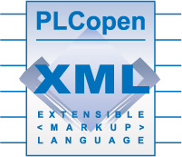
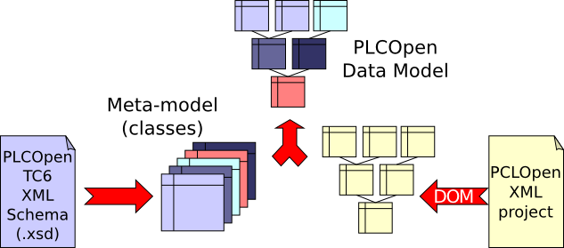
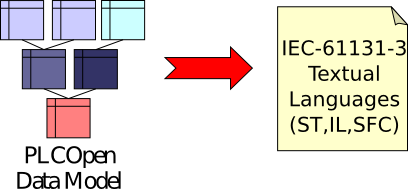
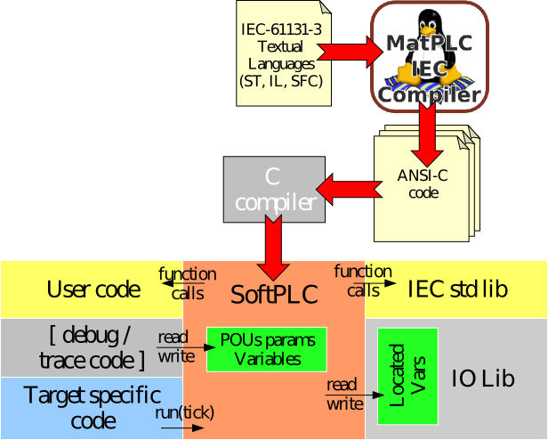
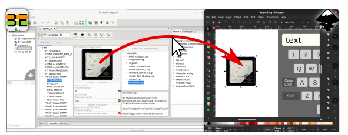
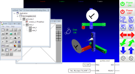

Overview: IDE and runtime(s)
============================

Beremiz is an integrated development environment for programming PLCs in
IEC 61131-3, paired with target runtimes that execute the generated code.

Many `collected documents and publications
<https://beremiz.github.io/collect>`_ have been contributed over the years.
See also the `screenshots <https://beremiz.github.io/screenshots>`_ and the
`YouTube channel
<https://www.youtube.com/channel/UCcE4KYI0p1f6CmSwtzyg-ZA>`_.

Presentation
------------

PLCopen TC6 based Model-View-Controller Editor
----------------------------------------------

Beremiz IDE provides a GUI for programming PLCs according to
`IEC 61131-3 <https://en.wikipedia.org/wiki/IEC_61131-3>`_, with projects
persisted as PLCopen TC6-XML so they can be exchanged with other compliant
tools.

The data model is derived from the official
`PLCopen TC6-XML XML Schema <http://www.plcopen.org/pages/tc6_xml/>`_:
the ``.xsd`` is parsed at startup to build a meta-model describing the
relations between PLCopen objects. As a side-effect, the editor can also be
used as a PLCopen TC6-XML validator.

Graphical languages (LD, FBD, SFC) have built-in export filters that produce
their equivalent textual form (ST / IL), which is what the toolchain consumes
downstream.

Toolchain
---------

The toolchain is built around `MatIEC <https://github.com/beremiz/matiec>`_,
an IEC 61131-3 compiler originally started in 2002 by Mario de Sousa
(U-Porto) as the ST/IL → C++ compiler of the MatPLC project, now maintained
as part of Beremiz.

MatIEC compiles ST, IL and SFC programs into ANSI-C. All POU parameters and
variables are exposed through nested C structs, and located variables are
declared as ``extern`` C symbols so they can be wired to platform-specific
I/O at link time.

Runtimes
--------

A runtime is the process that loads the shared object produced by the
toolchain, drives the periodic IEC scan, and exposes the running PLC to the
IDE through one of the connectors described in :doc:`programming/connect`.
Beremiz ships two interchangeable implementations sharing the same eRPC
interface (defined in ``erpc_interface/erpc_PLCObject.erpc``): a Python one
suited for hosts running a full OS, and a native C++ one targeting
resource-constrained or bare-metal systems.

Python runtime
^^^^^^^^^^^^^^

``runtime/`` hosts the Python runtime, launched by ``Beremiz_service.py`` and
licensed under LGPLv2+. ``PLCObject.py`` loads the compiled PLC as a shared
object, runs the scan loop, and is fronted by one or more network endpoints:

* **eRPC server** (``eRPCServer.py``) — primary RPC channel to the IDE / CLI,
  optionally wrapped in a TLS-PSK socket via ``Stunnel.py`` to provide the
  ``ERPCS://`` scheme.
* **WAMP client** (``WampClient.py``) — autobahn-based connector that joins a
  ``crossbar`` router, with PSK (WAMP-CRA) or client-certificate
  authentication.
* **Web interface** (``NevowServer.py``) — Twisted/Nevow HTTP front-end used by
  HMI extensions such as SVGHMI.
* **Service discovery** (``ServicePublisher.py``) — Zeroconf announcement so
  the IDE can locate the runtime on the LAN.

Platform-specific back-ends (Linux/POSIX, Windows, and Xenomai for hard
real-time) keep the core Python execution engine portable, while
``Worker.py`` and ``spawn_subprocess.py`` isolate the PLC scan from the
network-facing event loop.

C runtime
^^^^^^^^^

``C_runtime/`` hosts the native C/C++ runtime. It is functionally equivalent
to the Python runtime — same eRPC interface, same loaded shared object — but
carries no Python dependency, making it suitable for resource-constrained or
bare-metal deployments.

The public part of the runtime is distributed under the **GPLv3** (or later);
see ``C_runtime/COPYING_for_C_Runtime``. Because the project intends to keep
the option of dual-licensing future ports for embedded targets, **external
contributions to the C/C++ runtime require a copyright assignment to the
existing copyright holder, Edouard Tisserant**, before they can be merged.

The publicly-available code is structured as a portable core
(``PLCObject.cpp``) plus a reference POSIX back-end
(``PLCObjectPosix.cpp`` / ``posix_main.cpp``) used for Linux hosts and for
testing on a workstation.

Platform support for `Zephyr RTOS <https://www.zephyrproject.org/>`_, which
targets MCU boards (e.g. STM32 Nucleo-H563ZI), is maintained in a
**separate private branch** available under a **dual-license arrangement
subject to an NDA**. Contact the maintainer for
access terms.

Extensions
----------

Fieldbusses
^^^^^^^^^^^

CANopen
"""""""

`CANopen <https://en.wikipedia.org/wiki/CANopen>`_ is a CAN-based
communication system comprising higher-layer protocols and profile
specifications. Originally designed for motion-oriented machine control, it
is now used across medical equipment, off-road vehicles, maritime and railway
electronics, and building automation.

Beremiz' CANopen support depends on the
`CanFestival <https://canfestival.org/>`_ open-source CANopen stack — the
IDE consumes EDS files to configure master and slave nodes, and the runtime
links against the CanFestival library built from
`github.com/beremiz/canfestival <https://github.com/beremiz/canfestival>`_.
CanFestival is not vendored in the Beremiz tree and must be built separately
against the CAN interface of the target platform. See :doc:`install` for the build recipe.

Modbus
""""""

Modbus is a data communications protocol originally published by Modicon
(now Schneider Electric) in 1979 for use with its programmable logic
controllers, and has become a de facto standard for connecting industrial
electronic devices. Beremiz' Modbus client and server support relies on the
`Modbus library <https://hg.beremiz.org/Modbus>`_ for Beremiz and MatIEC
written by Mario de Sousa. All object types are supported, as client or
server, on both TCP/IP and serial.

EtherCAT
""""""""

EtherCAT (Ethernet for Control Automation Technology) is an Ethernet-based
fieldbus system invented by Beckhoff Automation, standardized in IEC 61158,
suitable for both hard and soft real-time control. Beremiz uses
`EtherLab's EtherCAT master <https://gitlab.com/etherlab.org/ethercat>`_.

OPC-UA
""""""

OPC Unified Architecture (OPC UA) is the cross-platform, open IEC 62541
standard for data exchange from sensors to cloud applications, maintained by
the `OPC Foundation <https://opcfoundation.org/>`_.

Beremiz' OPC-UA Client support lets the programmer browse an OPC-UA server
directly in the IDE thanks to `FreeOpcUa <https://github.com/FreeOpcUa>`_'s
`python-opcua <https://github.com/FreeOpcUa/python-opcua>`_. C code is
generated so that the runtime links with the
`open62541 <https://github.com/open62541/open62541>`_ OPC-UA stack to read
and write selected server variables.

BACnet
""""""

`BACnet <https://en.wikipedia.org/wiki/BACnet>`_ (Building Automation and
Control networks) is the ASHRAE / ANSI / ISO 16484-5 data communications
protocol for building automation systems — HVAC, lighting, access control,
fire detection and related equipment. Devices expose their data through
standard object types (Analog / Binary / Multi-state Inputs, Outputs and
Values, …) whose properties are read, written or subscribed to via BACnet
services, over transports such as BACnet/IP and MS/TP.

Beremiz' BACnet support — contributed by Mario de Sousa — lets the PLC act
as a BACnet device. A dedicated slave editor in the IDE is used to declare
the exposed objects and map their properties to located variables, and the
runtime links against the open-source
`BACnet Stack <https://sourceforge.net/projects/bacnet/>`_ maintained on
SourceForge. That library is not vendored in the Beremiz tree and must be
built separately as a shared library; see :doc:`install`.

HMI
^^^

SVGHMI
""""""

**SVGHMI** is Beremiz' modern, web-based HMI toolkit. HMI pages are drawn
in `Inkscape <https://inkscape.org>`_ following the WYSIWYG principle, with
Page and Widget roles assigned to SVG elements through their Inkscape
object name and description. PLC data exposed to the HMI is represented in
an HMI Tree derived from the POU instance tree, so the same SVG widgets
scale automatically as the underlying PLC program grows. At runtime the
generated HMI is served over HTTP/WebSocket by the Python runtime's
Twisted/Nevow front-end and rendered in any modern browser.

See :doc:`svghmi/index` for the full SVGHMI documentation — Inkscape
workflow, syntax, page composition, widget library, internationalisation,
fonts, configuration and hacking notes.

wxHMI
"""""

Beremiz' **wxHMI** extension lets the PLC project ship its own desktop GUI,
designed visually with the
`wxGlade <https://wxglade.sourceforge.net/>`_ GUI builder for the
`wxWidgets <https://www.wxwidgets.org/>`_ toolkit. The extension is exposed
as a "WxGlade GUI" confnode in the project tree: adding it produces a
``hmi.wxg`` source file that the IDE opens directly in wxGlade, together
with a companion Python file (provided by the ``py_ext`` Python-file
confnode) into which the PLC programmer wires the generated widgets to
located variables. At runtime the HMI is hosted inside the Python runtime
so it can read and write PLC variables in-process — no separate RPC channel
is required.

Platform specific I/Os and IDE integration
^^^^^^^^^^^^^^^^^^^^^^^^^^^^^^^^^^^^^^^^^^

Beremiz' extension system is open enough that vendors can integrate the IDE
and toolchain into their own product line, plugging the editor onto their
existing controllers, I/O catalogues and fieldbus stacks rather than
forcing customers onto generic hardware. CTNs and POU libraries are the
two main hooks: a vendor contributes CTNs to expose its proprietary I/O
modules and fieldbus configurations in the project tree, and ships
matching POU libraries plus runtime glue so that the generated PLC code
drops straight onto the target hardware.

Beremiz has been integrated this way with Smarteh's **LPC Composer** since
2009, providing IEC 61131-3 programming for Smarteh's LPC family of
programmable controllers. The integration covers Smarteh's proprietary C
runtime, the CANopen and Modbus fieldbusses used to interconnect their
devices, and their proprietary I/O modules.

.. image:: integrate.svg
   :align: center
