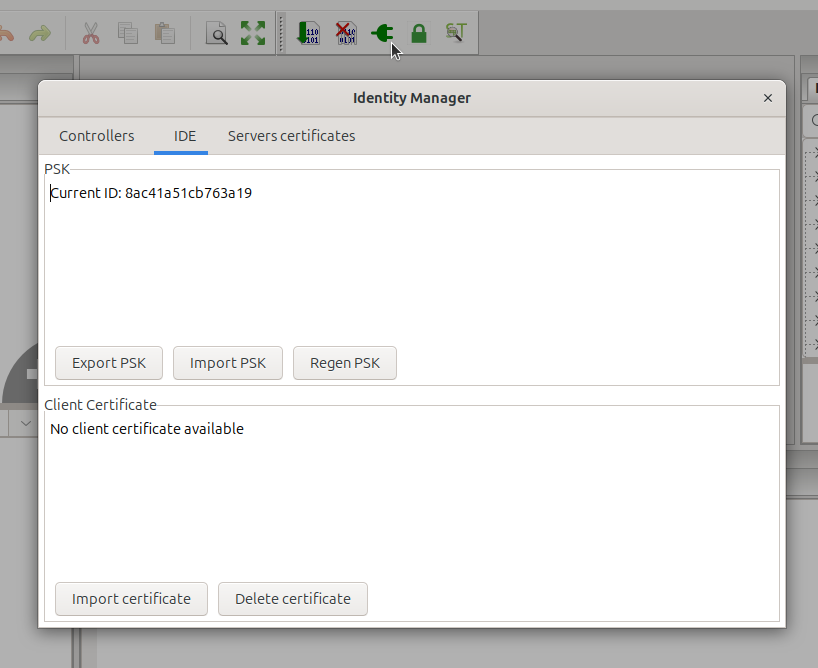

Connect IDE to Runtime
======================

Connection is described by the *URI_location* in project's configuration.
    ``Open project tree root -> Config tab -> URI_location``

eRPC
----

`eRPC <https://github.com/embeddedrpc/erpc>`_ (Embedded RPC) is an open source
Remote Procedure Call (RPC) developed by NXP. 

In case of Beremiz, Runtime is the eRPC server and IDE is a client. Transport
can be either TCP/IP or Serial.

``URI_location`` for eRPC:
^^^^^^^^^^^^^^^^^^^^^^^^^^^^
    * ``ERPC://host[:port]`` unencrypted connection. Default port is 3000.
        This connection is highly unsecure, and should never be used on
        untrusted network. It is intended to be used on peer to peer connection
        such as ethernet over USB, for initial pairing with IDE.
    * ``ERPCS://host[:port]`` SSL-PSK encrypted connection.
        Default port is 4000.
    * ``LOCAL://`` starts local runtime and connect with it through TCP/IP
        bound to Localhost using random port.

SSL-PSK setup:
^^^^^^^^^^^^^^

In order to provide practical secure communication in between runtime and IDE
TLS-PSK connection according to rfc4279.

Server (runtime)
""""""""""""""""
.. highlight:: ini

PSK ciphersuite avoids the need for public key operations and certificate
management. It is perfect for a performance-constrained environments with
limited CPU power as a PLC.

`Stunnel <https://www.stunnel.org/>`_ is used to wrap unencrypted eRPC server
into an TLS-PSK SSL socket. Hereafter is ``stunnel.conf``::

    [ERPCPSK]
    accept = 4000
    connect = 127.0.0.1:3000
    ciphers = PSK
    sslVersion = TLSv1.2
    PSKsecrets = psk.txt

.. highlight:: text

List PSK ciphers available in server's openssl::

    openssl ciphers -s -psk -tls1_2

Launch ``stunnel``::

    stunnel ./stunnel.conf

Client (IDE) 
""""""""""""

Compare client's available openssl PSK ciphers with Server's ciphers. At least
a few of them should match::

    openssl ciphers -s -psk -tls1_2

Use unencrypted peer-to-peer connection such as network over USB 
or simple Ethernet cable, connect an obtain PSK::

    ERPC://hostname[:port]

Then use Identity Management dialog in IDE to select matching ID and generate
``ERPCS`` URI::

    ERPCS://hostname[:port]#ID

WAMP
----

`WAMP <https://wamp-proto.org/>`_ is an open standard WebSocket subprotocol that provides two application messaging
patterns in one unified protocol: Remote Procedure Calls + Publish & Subscribe.

Beremiz WAMP connector implementation uses python ``autobahn`` module, from the `crossbar.io <https://github.com/crossbario>`_ project.

Both IDE and runtime are WAMP clients that connect to ``crossbar`` server through HTTP.

``URI_location`` for WAMP:
^^^^^^^^^^^^^^^^^^^^^^^^^^

    * ``WAMP://host[:port]/path#realm#ID`` Websocket over unencrypted HTTP transport.
        ``ID`` is the WAMP ``authid`` the runtime will register under, ``realm``
        is the crossbar realm both peers join.
    * ``WAMPS://host[:port]/path#realm#ID`` Websocket over secure HTTPS transport,
        using WAMP-CRA (Challenge-Response Authentication) over a TLS-encrypted
        WebSocket. Both peers authenticate with a shared secret (PSK).
    * ``WAMPS-CRT://host[:port]/path#realm#ID`` Websocket over secure HTTPS
        transport with mutual TLS — the client authenticates by presenting an
        X.509 certificate which the crossbar router validates.

The ``path`` segment (commonly ``/ws``) selects the WebSocket route published
by the crossbar configuration.

Crossbar server
^^^^^^^^^^^^^^^

Beremiz does not embed a WAMP router — a ``crossbar`` instance must be reachable
by both IDE and runtime. A minimal router declares one ``realm`` (e.g.
``Automation``) with a single ``authenticated`` role granting ``call``,
``register``, ``publish`` and ``subscribe`` on every URI.

For ``WAMPS`` the WebSocket transport carries a TLS endpoint referencing a
server certificate and key, and the ``ws`` path enables the ``wampcra``
authenticator with a static user list — one entry per peer, holding its
``ID`` and PSK ``secret``.

For ``WAMPS-CRT`` the TLS endpoint additionally lists the CA certificates
accepted for client authentication (``ca_certificates``), and the ``ws`` path
uses the ``tls`` dynamic authenticator. Dynamic authentication is implemented
by a small Python component registered with the router (e.g. via
``"type": "class"`` under ``components``) that exposes the procedure named in
``auth.tls.authenticator`` (e.g. ``automation.authenticate``). On every
connection crossbar calls it with the peer's certificate; the component
typically matches the SHA-1 fingerprint against an allowed list and returns
the resolved ``authid`` and ``role``.

Runtime (PLC) setup
^^^^^^^^^^^^^^^^^^^

The runtime is enabled as a WAMP client by passing ``-c wampconf.json`` to
``Beremiz_service.py``. The configuration file has the form::

    {
        "ID": "<PLC_wamp_ID>",
        "active": true,
        "protocolOptions": {
            "autoPingInterval": 60,
            "autoPingTimeout": 20
        },
        "realm": "Automation",
        "authentication": "PSK",
        "url": "wss://host:port/ws"
    }

The ``authentication`` field selects the scheme: ``"PSK"`` for ``WAMPS`` (the
runtime reads its ``ID`` / secret from the PSK file given with
``-s psk.txt``; this file is auto-generated on first start when missing) or
``"ClientCertificate"`` for ``WAMPS-CRT``. In the latter case
``verifyHostname`` controls server-hostname checking, the trusted server
certificate is read from ``wampTrustStore.crt`` next to the runtime, and the
client certificate + private key are read from ``wampClientCert.pem``.

IDE / CLI setup
^^^^^^^^^^^^^^^

IDE provide a GUI to manage certificates.

The IDE and ``Beremiz_cli.py`` resolve credentials and trust material under
``$BEREMIZ_APPDATA/keystore``:

    * ``own/default.psk`` — IDE's own PSK (``ID:secret``), auto-generated on
        first launch and registered into the crossbar static user list for
        ``WAMPS``.
    * ``own/client.crt`` — IDE's client certificate + key in PEM form, used
        for ``WAMPS-CRT``.
    * ``cert/<host>.crt`` — server certificate(s) trusted for the matching
        host name.

Once these are in place, setting the project's ``URI_location`` to the chosen
``WAMP`` / ``WAMPS`` / ``WAMPS-CRT`` URI is sufficient for the IDE to connect.
Both ``tests/cli_tests/wamp_test_PSK_and_TLS.bash`` and
``tests/cli_tests/wamp_test_client_cert.bash`` exercise the full pairing
sequence end-to-end and can be used as reference setups.
