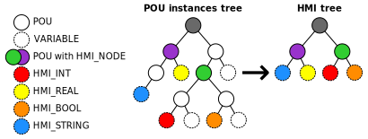
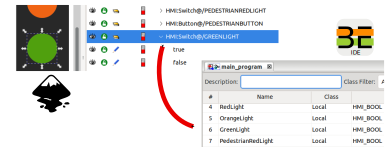

Introduction to SVGHMI
======================

+-----------------------------+-------------------------------------------------------------------------------+
|                             | SVGHMI is a SVG based HMI toolkit. With it, PLC programmers and HMI designers |
| .. image:: svhgmi_pitch.svg | can efficiently produce Scalable Web Based HMIs.      HMI design    |
|                             | happens in `Inkscape  <https://inkscape.org>`_.                               |
|                             | Designer freely draws HMI pages and widgets following WYSIWYG principle.      |
+-----------------------------+-------------------------------------------------------------------------------+

WYSIWYG HMI design with Inkscape
--------------------------------

    "**What You See Is What You Get**, is a system in which editing software
    allows content to be edited in a form that resembles its appearance when
    printed or displayed as a finished product."
    
    -- Oxford English Dictionary

Widgets can be selected from customizable widget library and drag'n'dropped
directly in Inkscape.

.. image:: svghmi_dnd.svg

SVGHMI's Page and Widget roles are assigned to SVG elements by changing objects
name and description in Inkscape.

.. image:: svhgmi_inkscape.svg

HMI tree scale together with PLC instance tree
----------------------------------------------

In SVGHMI, **scalability** applies to both graphics and data. Once HMI and PLC
are associated in a first version of a machine, it is easy to extend both of
them simultaneously. In most cases DRY principle applies. PLC code or SVG
elements can be re-used and extended.

PLC data exposed to HMI is represented in an "HMI Tree" deduced from PLC
program. More precisely, HMI Tree is a simplified subset of POU instances tree.
PLC  programmer selects variables to be exposed by assigning them a derived
HMI_* type. For example HMI_REAL is used instead of REAL to expose a floating
point variable.

In order to reduce HMI Tree complexity, structure of POU instance tree is not
preserved by default. Only POUs having a single HMI_NODE variable defined
appear in HMI Tree. This allows to expose variables that are spread in a
complex hierarchy of POUs in a single HMI Tree node.

Re-usable widgets and pages
---------------------------

HMI elements are SVG elements whose labels start with ``HMI:``.  They can be
widgets or pages, and can point to locations in HMI tree with a path starting
with a ``/``, and with ``/``-separated hierarchical levels.
For example, ``/THIS/IS/A/VALID/HMI_TREE/PATH``.

``HMI:Switch@/GREENLIGHT``
    "Switch" type widget bound to a variable named GREENLIGHT at root of HMI tree

Each ``HMI:Page`` has a unique name. ``HMI:Jump`` and ``HMI:Back`` widgets are
used to switch to other pages. PLC can also trigger page change autonomously.
HMI must have at least one SVG element labelled ``HMI:Page:Home``. ``Home`` is
a special page name: it will make this page the landing page when HMI is loaded.

.. image:: svhgmi_pages.svg

``HMI:Page:Home``
    Mandatory "Home" page declaration

``HMI:Jump:Home``
    Change current page to "Home" page when clicked

``HMI:Back``
    Change current page back to previous page when clicked

Pages and groups of widgets can be dynamically re-based to another compatible
HMI Tree location. They can then be be re-used as HMI components, paired with
corresponding POU instances on PLC side.

Simple yet powerful widgets
---------------------------

Widgets are meant to be as simple as possible. Still, they can become complex
when implementing interactions that cannot be broken down into multiple
independent widgets.

+------------------------------------+---------------------------------+
| Meter Widget Template (`HMI:Meter`)|      Voltmeter (`HMI:Meter`)    | 
+====================================+=================================+
| .. image:: svghmi_meter.svg        | .. image:: svghmi_voltmeter.svg |
+------------------------------------+---------------------------------+

HMI and pages have their own local variables allowing interaction in between
widgets bypassing HMI Tree. For example, position of `HMI:Scrollbar` can be
directly connected to a position in `HMI:JSONTable` with a page local
variable.

How does it work ?
------------------

HMI's client and server code is generated during SVGHMI build, based on PLC 
code and HMI design.

.. image:: svghmi_overview.svg

SVGHMI build is part of Beremiz build, available in IDE and command line.
